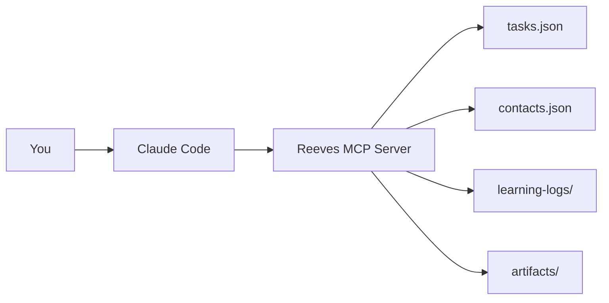

# What is Reeves?

Reeves is the best task management system available until AGI gets here. It's your personal AI assistant that manages your entire life—family, friends, house projects, legal matters, side businesses, and yes, even software development if that's your thing.

## The Problem

Life is messy. You're juggling:

- **Family events** - Birthdays, lunches with the kids, keeping up with relatives
- **House projects** - Contractors, repairs, sales, renovations
- **Relationships** - Following up with friends, remembering how to talk to each person
- **Legal matters** - Court dates, attorney calls, document deadlines
- **Side businesses** - Partnership discussions, client work, project coordination
- **Daily life** - Expenses, errands, appointments, random tasks

And when using AI assistants:

- **Context gets lost** between conversations
- **Tasks are forgotten** after sessions end
- **Follow-ups disappear** into the void
- **People details** vanish (how do I talk to this person again?)
- **You repeat yourself** constantly

## The Solution

Reeves remembers **everything**:

- Every task you create
- Every project context
- Every contact preference
- Every strategic decision
- Every follow-up needed

And it's all **persistent**. Close Claude Code. Restart. Come back tomorrow. Reeves remembers.

## How It Works

1. You talk to Claude Code naturally
2. Claude uses Reeves MCP tools
3. Reeves saves everything to JSON files
4. Next session: all context is preserved

## Core Features

### 🎯 Task Management
- Create, update, complete tasks
- Track status and priority
- Add notes and context
- Link to projects

### 📂 Project Organization
- Group related tasks
- Attach context files
- Track project lifecycle
- Strategic decision logs

### 👥 Contact Management
- Communication preferences
- Tone and formality rules
- Recent interaction history
- Links to detailed context

### 📝 Learning Logs
- Capture project history
- Interview transcripts
- Strategic thinking
- Context preservation

### 🔒 Message Safety
- Double-verify protocol
- Prevent wrong recipients
- Tone-aware drafting
- Phone verification

## Philosophy

Reeves is designed for **AI reasoning, not rigid automation**.

You don't configure complex dependencies or workflows. You just tell Claude what needs to happen, and Reeves tracks it in plain English.

### Build for Understanding

- **Read all tasks** and understand dependencies naturally
- **Make judgment calls** about task priority
- **Skip overly complex** dependency systems
- **Trust plain English** notes over strict schemas

### Intentionally Simple

Reeves uses plain JSON files instead of a database because:

- Files are easy to **read** (open in any editor)
- Files are easy to **edit** (fix mistakes directly)
- Files are easy to **debug** (see exactly what's stored)
- Files are easy to **backup** (simple file copy)
- No Docker containers
- No database migrations
- No complexity

When you outgrow JSON (~300 tasks), there's a clear migration path to SQLite or Postgres. But most users never need it.

## Who is Reeves For?

Reeves is perfect for:

- **Parents** coordinating family life, kids' events, household projects
- **Homeowners** managing contractors, repairs, and house sales
- **Busy professionals** juggling work, family, side projects
- **People with legal matters** tracking court dates, attorney calls, document deadlines
- **Entrepreneurs** managing multiple ventures and partnerships
- **Anyone** whose life is too complex for sticky notes and scattered lists

**Software developers can use it too**, but Reeves was built for the messy reality of human life, not just code.

## What Reeves is Not

Reeves is **not**:

- A team collaboration tool (it's deeply personal)
- A calendar replacement (it's task and context-focused)
- A CRM for businesses (it's for YOUR life)
- A time tracker (it's about remembering, not billing)

## Next Steps

Ready to get started?

1. [Install Reeves](/guide/installation)
2. [Create your first task](/guide/getting-started)
3. [Explore real-world examples](/examples/real-world)
