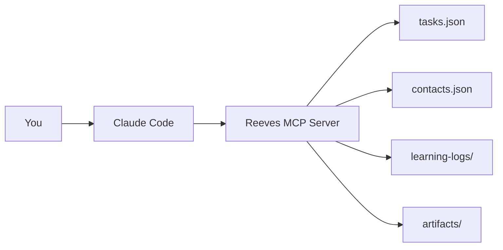

# What is Reeves?

Reeves is a persistent task management system designed for AI-first workflows. It maintains state across Claude Code sessions, manages complex projects, and helps coordinate life's moving parts.

## The Problem

When working with AI assistants like Claude Code:

- **Context gets lost** between sessions
- **Tasks are forgotten** after conversations end
- **Follow-ups disappear** into the void
- **Project history** vanishes
- **You repeat yourself** constantly

## The Solution

Reeves remembers **everything**:

- Every task you create
- Every project context
- Every contact preference
- Every strategic decision
- Every follow-up needed

And it's all **persistent**. Close Claude Code. Restart. Come back tomorrow. Reeves remembers.

## How It Works

1. You talk to Claude Code naturally
2. Claude uses Reeves MCP tools
3. Reeves saves everything to JSON files
4. Next session: all context is preserved

## Core Features

### 🎯 Task Management
- Create, update, complete tasks
- Track status and priority
- Add notes and context
- Link to projects

### 📂 Project Organization
- Group related tasks
- Attach context files
- Track project lifecycle
- Strategic decision logs

### 👥 Contact Management
- Communication preferences
- Tone and formality rules
- Recent interaction history
- Links to detailed context

### 📝 Learning Logs
- Capture project history
- Interview transcripts
- Strategic thinking
- Context preservation

### 🔒 Message Safety
- Double-verify protocol
- Prevent wrong recipients
- Tone-aware drafting
- Phone verification

## Philosophy

Reeves is designed for **AI reasoning, not rigid automation**.

You don't configure complex dependencies or workflows. You just tell Claude what needs to happen, and Reeves tracks it in plain English.

### Build for Understanding

- **Read all tasks** and understand dependencies naturally
- **Make judgment calls** about task priority
- **Skip overly complex** dependency systems
- **Trust plain English** notes over strict schemas

### Intentionally Simple

Reeves uses plain JSON files instead of a database because:

- Files are easy to **read** (open in any editor)
- Files are easy to **edit** (fix mistakes directly)
- Files are easy to **debug** (see exactly what's stored)
- Files are easy to **backup** (simple file copy)
- No Docker containers
- No database migrations
- No complexity

When you outgrow JSON (~300 tasks), there's a clear migration path to SQLite or Postgres. But most users never need it.

## Who is Reeves For?

Reeves is perfect for:

- **Engineers** managing personal projects
- **Entrepreneurs** juggling multiple ventures
- **Freelancers** tracking client work
- **Students** organizing research projects
- **Anyone** who uses Claude Code regularly

## What Reeves is Not

Reeves is **not**:

- A team collaboration tool (it's personal)
- A time tracker (it's task-focused)
- A calendar (it's context-focused)
- A replacement for your project manager (it's a supplement)

## Next Steps

Ready to get started?

1. [Install Reeves](/guide/installation)
2. [Create your first task](/guide/getting-started)
3. [Explore real-world examples](/examples/real-world)
